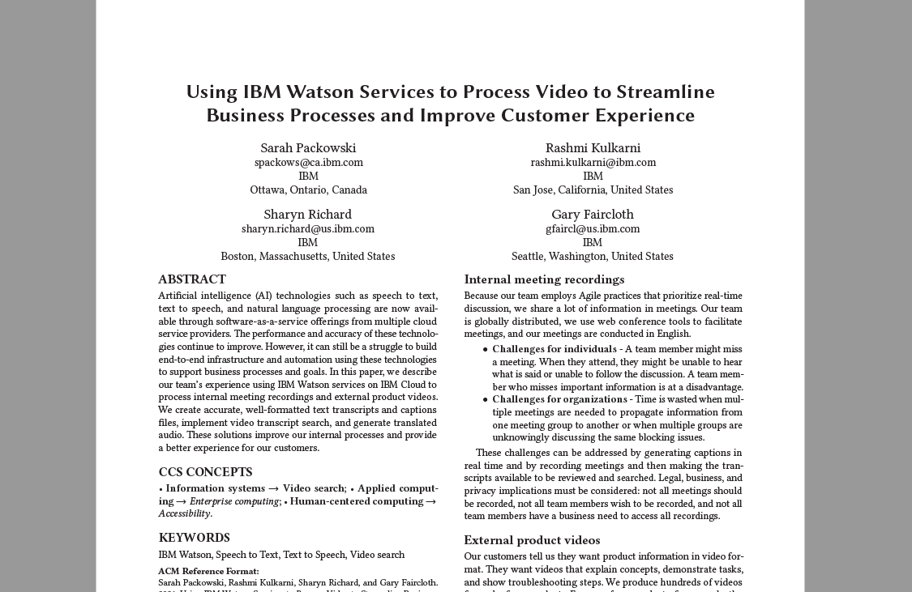
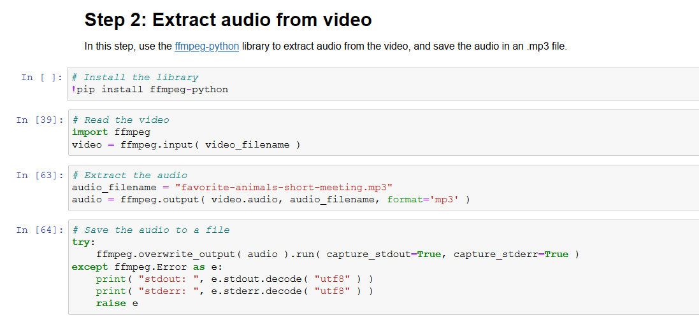
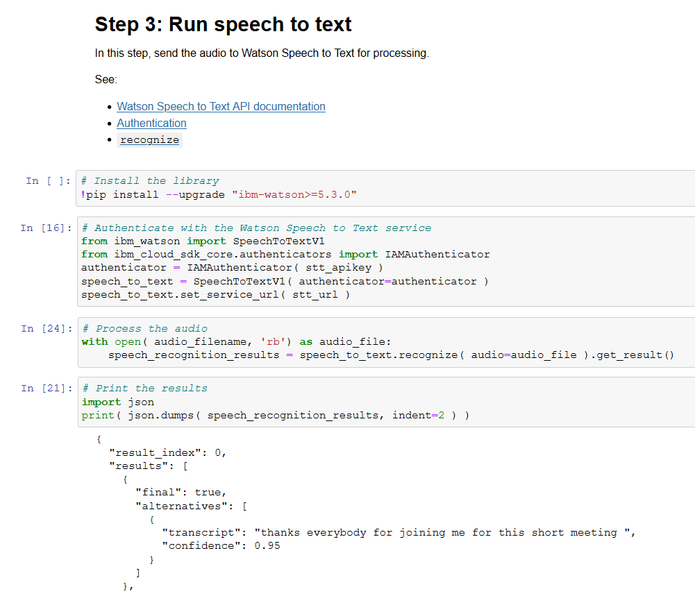
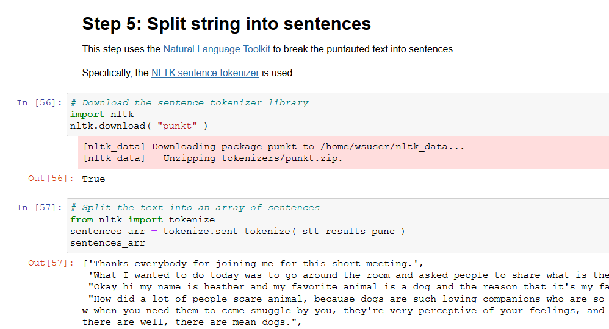
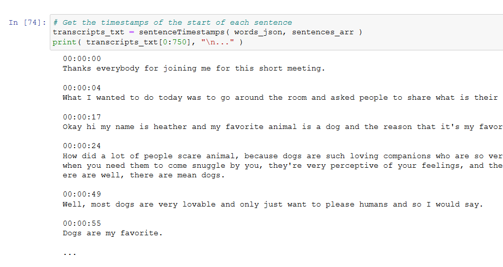
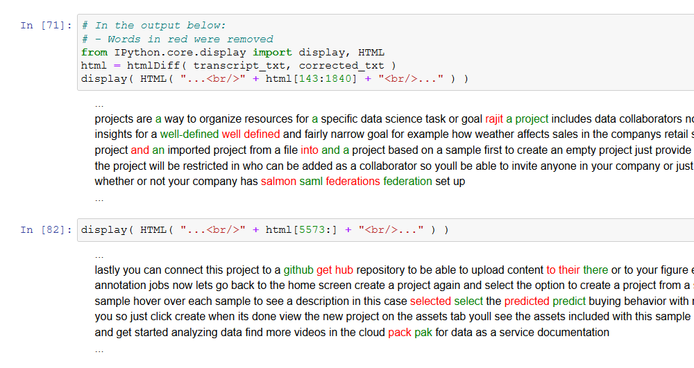
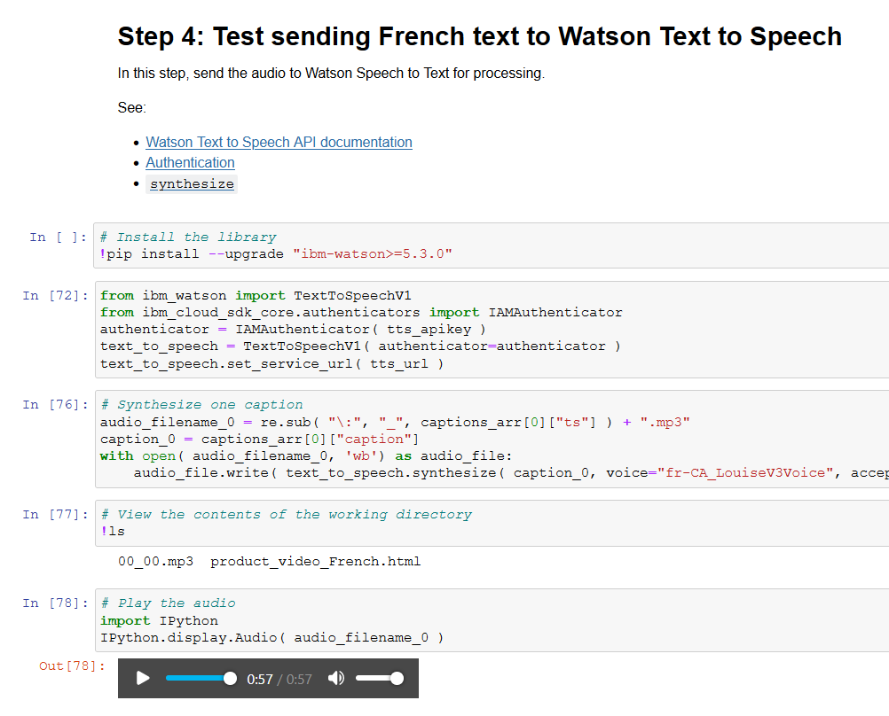

# Using IBM Watson Services to Process Video to Streamline Business Processes and Improve Customer Experience

Sarah Packowski ( spackows@ca.ibm.com ) 
Rashmi Kulkarni ( rashmi.kulkarni@ibm.com ) 
Sharyn Richard ( sharyn.richard@us.ibm.com ) 
Gary Faircloth ( gfaircl@us.ibm.com )

This repo contains samples and supporting information for a paper presentation at **CASCON x EVOKE 2021**.

**Links:**
- [Paper presentation](https://pheedloop.com/casconevoke2021/site/sessions/?id=SESPZ87C5K5VZKT28)
- [CASCON x EVOKE 2021](https://pheedloop.com/casconevoke2021/site/home)
- [IBM Canada Advanced Studies](https://www-01.ibm.com/ibm/cas/canada)

&nbsp;

## [Paper]

**Link:** [Using_IBM_Watson_to_Process_Video.pdf](Using_IBM_Watson_to_Process_Video.pdf)

&nbsp;

## [Samples]

Here are collection of Python notebooks that demonstrate the tasks described in the paper:
- [Sample 1: Extract audio from video](#sample-1-extract-audio-from-video)
- [Sample 2: Send audio to Watson Speech to Text](#sample-2-send-audio-to-watson-speech-to-text)
- [Sample 3: Add punctuation to speech to text transcript](#sample-3-add-punctuation-to-speech-to-text-transcript)
- [Sample 4: Get sentence timestamps](#sample-4-get-sentence-timestamps)
- [Sample 5: Create diffs for retraining speech to text model](#sample-5-create-diffs-for-retraining-speech-to-text-model)
- [Sample 6: Translate audio of product videos](#sample-7-translate-audio-of-product-videos)
- [Sample 7: Find themes in meeting transcript](#sample-6-find-themes-in-meeting-transcript)

&nbsp;

### Sample 1: Extract audio from video

**Link:** [Extract-audio-from-video.ipynb](https://github.com/spackows/CASCON-2021_Processing_video/blob/main/notebooks/Extract-audio-from-video.ipynb)

This Python notebook demonstrates how to use [`ffmpeg-python`](https://github.com/kkroening/ffmpeg-python) to extract audio (.mp3) from a video (.mp4) file.  

The video is a [sample meeting recording](https://github.com/spackows/CASCON-2021_Processing_video/blob/main/sample-meeting/favorite-animals-short-meeting.mp4?raw=true) where a team discusses favorite animals.

&nbsp;

### Sample 2: Send audio to Watson Speech to Text

**Link:** [Run-Watson-Speech-to-Text.ipynb](https://github.com/spackows/CASCON-2021_Processing_video/blob/main/notebooks/Run-Watson-Speech-to-Text.ipynb)

This Python notebook demonstrates using the [Watson Speech to Text API](https://cloud.ibm.com/apidocs/speech-to-text?code=python) to send audio for processing.  

The [sample audio](https://github.com/spackows/CASCON-2021_Processing_video/blob/main/sample-meeting/favorite-animals-short-meeting.mp3?raw=true) is from a meeting recording where a team discusses favorite animals.

&nbsp;

### Sample 3: Add punctuation to speech to text transcript

**Link:** [Add-punctuation-and-split-into-sentence.ipynb](https://github.com/spackows/CASCON-2021_Processing_video/blob/main/notebooks/Add-punctuation-and-split-into-sentence.ipynb)

This Python notebook demonstrates using the Python library [`punctuator`](https://pypi.org/project/punctuator/) to add punctuation and capitalization to the [Speech to Text output](https://github.com/spackows/CASCON-2021_Processing_video/blob/main/sample-meeting/favorite-animals-short-meeting.txt) of a meeting recording where a team discusses favorite animals.

A pretrained model, created by [Ottokar Tilk](https://ee.linkedin.com/in/ottokar-tilk), is used.  See: [Paper: Bidirectional Recurrent Neural Network with Attention Mechanism for Punctuation Restoration](https://www.isca-speech.org/archive/pdfs/interspeech_2016/tilk16_interspeech.pdf)

The notebook also demonstrates using the [Natural Language Toolkit](https://www.nltk.org) to break the punctuated transcript into an array of sentences.

&nbsp;

### Sample 4: Get sentence timestamps

**Link:** [Get-sentence-timestamps.ipynb](https://github.com/spackows/CASCON-2021_Processing_video/blob/main/notebooks/Get-sentence-timestamps.ipynb)

This Python notebook demonstrates using the [word timestamps](https://github.com/spackows/CASCON-2021_Processing_video/blob/main/sample-meeting/favorite-animals-short-meeting_words.json) from Watson Speech to Text to find the timestamp of the beginning of each sentence in the transcript.

The [sample transcript sentences array](https://github.com/spackows/CASCON-2021_Processing_video/blob/main/sample-meeting/favorite-animals-short-meeting_sentences_arr.json) is from a meeting recording where a team discusses favorite animals.

&nbsp;

### Sample 5: Create diffs for retraining speech to text model

**Link:** [Create-diffs-to-retrain-STT-model.ipynb](https://github.com/spackows/CASCON-2021_Processing_video/blob/main/notebooks/Create-diffs-to-retrain-STT-model.ipynb)

This Python notebook demonstrates using the Python library [`difflib`](https://docs.python.org/3/library/difflib.html) to compare [Speech to Text results](https://github.com/spackows/CASCON-2021_Processing_video/blob/main/sample-product-video/product_video.txt) with a [manually corrected transcript](https://github.com/spackows/CASCON-2021_Processing_video/blob/main/sample-product-video/product_video_corrected.txt).

The notebook also demonstrates how to generate baseline custom words dictionaries for customizing your Watson Speech to Text language model.  See: [Creating a custom language model](https://cloud.ibm.com/docs/speech-to-text?topic=speech-to-text-languageCreate)

The transcripts are from a Watson Studio product video.  This video contains domain-specific, technical jargon.  Customizing our Watson Speech to Text model for these domain-specific, technical terms improved speech to text results dramatically.

&nbsp;

### Sample 6: Translate audio of product videos

**Link:** [Translate-audio.ipynb](https://github.com/spackows/CASCON-2021_Processing_video/blob/main/notebooks/Translate-audio.ipynb)

We generate our videos in English, embed video captions in our product documentation in HTML tables, and then send the HTML to be translated by (human) professional translators.

This Python notebook demonstrates reading [a sample HTML table](https://github.com/spackows/CASCON-2021_Processing_video/blob/main/sample-product-video/product_video_French.html) containing French video captions and then synthesizing audio for the captions using Watson Text to Speech.

&nbsp;

### Sample 7: Find themes in meeting transcript

&nbsp;

